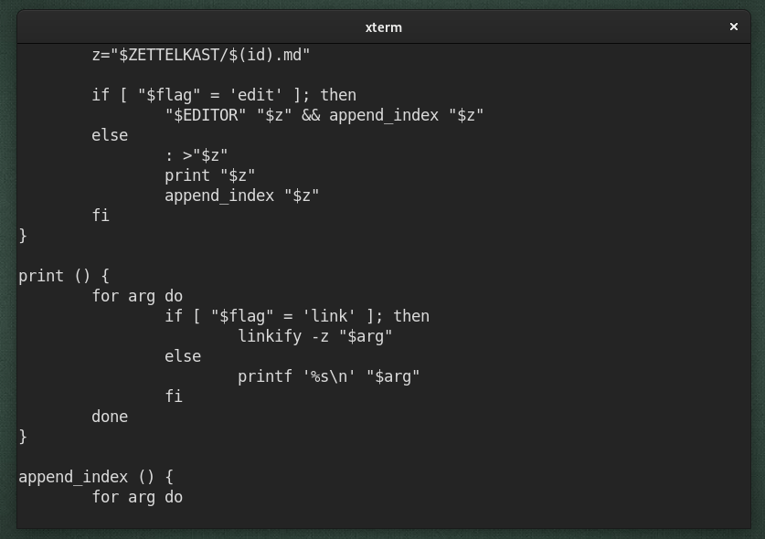

# `cmt`

A simple filter which toggles various types of comments. Easily extensible and
written in POSIX sh.

## Motivation

I wanted an easier way to write comments, both for formatting and debugging
purposes. I didn't want to have to deal with plugins and, this approach is
inherently compatible with all versions of `vi` and `vim` without the need to
install any plugin or plugin manager.

## Goals

* As small and simple as possible
* Minimum hassle to install/configure
* Compatible/portable

## Install

Should work fine in any POSIX compliant shell.


```shell
# `foo` is a directory in your `$PATH`
cd foo

# Download the raw script file
curl -so ./cmt https://raw.githubusercontent.com/jaf7C7/cmt/master/cmt 

# Make the script executable
chmod +x cmt
```

Or alternatively if you want the entire repo:

```shell
# Clone the repository
git clone https://github.com/jaf7C7/cmt

# Enter the repository
cd cmt

# Make the script executable
chmod +x cmt

# Create a symlink to the executable in a directory `foo` in your `$PATH`
ln -s cmt foo/cmt

```

Don't forget to make the `cmt` file executable with `chmod +x cmt`

## Example usage

Block comments:


Debugging:

